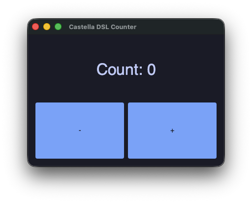
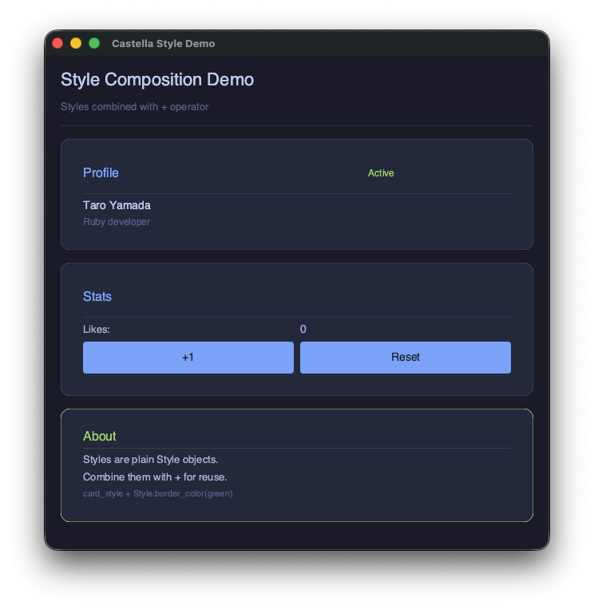

# Konpeito

> *Konpeito (konpeitō) — Japanese sugar crystals. Crystallizing Ruby into native code.*

A gradually typed Ruby compiler with Hindley-Milner type inference, dual LLVM/JVM backends, and seamless Java interop.

Write ordinary Ruby. Konpeito infers types automatically, compiles to fast native code, and falls back to dynamic dispatch where it can't resolve statically — with a warning so you always know.

## How It Works

Konpeito uses a three-tier type resolution strategy:

1. **HM inference** resolves most types automatically — no annotations needed. Like Crystal, but for Ruby.
2. **RBS annotations** add precision where needed. Optional type hints that help the compiler optimize further.
3. **Dynamic fallback** handles the rest. Unresolved calls compile to runtime dispatch (LLVM: `rb_funcallv`, JVM: `invokedynamic`), and the compiler warns you.

Adding an RBS signature promotes a dynamic fallback to static dispatch. The compiler tells you where the boundaries are — fix them if you want, or leave them dynamic. Your call.

## Quick Start

### Prerequisites

Ruby 4.0+ is required. Java 21+ is needed for the JVM backend. LLVM 20 is needed only for the CRuby native backend.

```bash
gem install konpeito
```

**JVM backend** (recommended — standalone JARs, Castella UI, Java interop):
```bash
# macOS
brew install openjdk@21

# Ubuntu / Debian
sudo apt install openjdk-21-jdk

# Fedora
sudo dnf install java-21-openjdk-devel

# Windows (MSYS2 / MinGW)
winget install EclipseAdoptium.Temurin.21.JDK
```

**CRuby native backend** (optional — C extensions):
```bash
gem install ruby-llvm

# macOS
brew install llvm@20
ln -sf /opt/homebrew/opt/llvm@20/lib/libLLVM-20.dylib /opt/homebrew/lib/

# Ubuntu / Debian
sudo apt install llvm-20 clang-20

# Fedora
sudo dnf install llvm20 clang20

# Windows (MSYS2 / MinGW)
winget install LLVM.LLVM
```

### Hello World

Write a small Ruby file:

```ruby
# math.rb
def add(a, b)
  a + b
end

def sum_up_to(n)
  total = 0
  i = 1
  while i <= n
    total = total + i
    i = i + 1
  end
  total
end
```

Compile and use it from Ruby:

```bash
konpeito build math.rb          # produces math.bundle (macOS), math.so (Linux), or math.dll (Windows)
```

```ruby
require_relative "math"
puts add(3, 4)        # => 7
puts sum_up_to(100)   # => 5050
```

A few more commands to get you going:

```bash
konpeito doctor                        # check your environment
konpeito run --target jvm main.rb      # compile and run in one step
konpeito fmt                           # format source files
konpeito fmt --check                   # check formatting without modifying
```

## Features

- **HM Type Inference** — Types are inferred automatically. No annotations needed for most code.
- **Gradual Typing** — Static where possible, dynamic where necessary. The compiler shows you the boundary.
- **Flow Typing** — Type narrowing via `if x.nil?`, `case/in Integer`, boolean guards, and more.
- **Unboxed Arithmetic** — Integer and Float operations compile to native CPU instructions, skipping Ruby's method dispatch entirely.
- **Loop Optimizations** — LICM, inlined iterators (`each`, `map`, `reduce`, `times`), and LLVM O2 passes.
- **CRuby C Extensions** — Output plugs directly into your existing Ruby app via `require`.
- **JVM Backend** — Generate standalone `.jar` files that run on any Java 21+ VM.
- **Java Interop** — Call Java libraries directly with full type safety. Java type information flows into HM inference automatically.
- **Native Data Structures** — `NativeArray[T]`, `NativeHash[K,V]`, `StaticArray[T,N]`, `Slice[T]`, `@struct` value types for high-performance data handling.
- **C Interop** — Call external C libraries with `%a{cfunc}` / `%a{ffi}`, plus built-in HTTP (libcurl), Crypto (OpenSSL), and Compression (zlib) modules.
- **SIMD Vectorization** — `%a{simd}` compiles vector types to LLVM vector instructions.
- **Operator Overloading** — Define `+`, `-`, `*`, `==`, `<=>`, etc. on your own classes with full type inference.
- **Pattern Matching** — Full `case/in` support with array, hash, guard, and capture patterns.
- **Modern Ruby Syntax** — `_1`/`_2` numbered params, `it`, endless methods, `class << self`, safe navigation (`&.`), and more.
- **Concurrency** — Fiber, Thread, Mutex, ConditionVariable, SizedQueue, and Ractor (with `Ractor::Port`, `Ractor.select`, `Ractor[:key]` local storage, `name:`, `monitor`/`unmonitor`). JVM Ractor uses Virtual Threads for scheduling but does not enforce object isolation — objects are shared by reference, unlike CRuby's strict isolation model.
- **Built-in Tooling** — Formatter (`fmt`), LSP (hover, completion, go-to-def, references, rename), debug info (`-g`), and profiling (`--profile`).
- **Castella UI** — A reactive GUI framework for the JVM backend (see below).

## JVM Backend

Konpeito can also compile to JVM bytecode, producing standalone JAR files:

```bash
konpeito build --target jvm -o app.jar main.rb
# or compile and run immediately:
konpeito build --target jvm --run main.rb
```

The JVM backend supports seamless Java interop — call Java libraries directly from your Ruby code without writing any glue. Java type information is introspected from the classpath and fed into HM inference, so calling Java APIs is type-safe without annotations.

## Castella UI

A reactive GUI framework for the JVM backend, powered by [JWM](https://github.com/HumbleUI/JWM) + [Skija](https://github.com/HumbleUI/Skija).

### DSL

Ruby's block syntax becomes a UI DSL — `column`, `row`, `text`, `button` etc. nest naturally with keyword arguments. A plain Ruby method is a reusable component.

<p align="center">
  
</p>

```ruby
def view
  column(padding: 20.0, spacing: 16.0) {
    row(spacing: 12.0) {
      text("Analytics Dashboard", font_size: 26.0, bold: true)
      spacer
      button("Refresh", width: 90.0) {}
    }.fixed_height(40.0)

    # KPI Cards — extract a method, and it's a reusable component
    row(spacing: 12.0) {
      kpi_card("Revenue", "$48,250", "+12.5%", $theme.accent)
      kpi_card("Users",   "3,842",   "+8.1%",  $theme.success)
      kpi_card("Orders",  "1,205",   "-2.3%",  $theme.error)
    }

    # Charts, tables, and layouts compose with blocks
    row(spacing: 12.0) {
      column(expanding_width: true, bg_color: $theme.bg_primary, border_radius: 10.0, padding: 14.0) {
        bar_chart(labels, data, ["Revenue", "Costs"]).title("Monthly Overview").fixed_height(220.0)
      }
      column(expanding_width: true, bg_color: $theme.bg_primary, border_radius: 10.0, padding: 14.0) {
        data_table(headers, widths, rows).fixed_height(200.0)
      }
    }
  }
end

# A Ruby method is a reusable component
def kpi_card(label, value, change, color)
  column(spacing: 6.0, bg_color: $theme.bg_primary, border_radius: 10.0, padding: 16.0, expanding_width: true) {
    text(label, font_size: 12.0, color: $theme.text_secondary)
    text(value, font_size: 24.0, bold: true)
    text(change, font_size: 13.0, color: color)
  }
end
```

### Reactive State

`state(0)` creates an observable value, and the UI re-renders automatically when it changes:

<p align="center">
  
</p>

```ruby
class Counter < Component
  def initialize
    super
    @count = state(0)
  end

  def view
    column(padding: 16.0, spacing: 8.0) {
      text "Count: #{@count}", font_size: 32.0, align: :center
      row(spacing: 8.0) {
        button(" - ") { @count -= 1 }
        button(" + ") { @count += 1 }
      }
    }
  end
end
```

An OOP-style API (`Column(...)`, `Row(...)`) is also available. Available widgets: `Text`, `Button`, `TextInput`, `MultilineText`, `Column`, `Row`, `Image`, `Checkbox`, `Slider`, `ProgressBar`, `Tabs`, `DataTable`, `TreeView`, `BarChart`, `LineChart`, `PieChart`, `Markdown`, and more.

### Style Composition

Styles are first-class objects — store them in variables and compose with `+`:

<p align="center">
  
</p>

```ruby
card = Style.new.bg_color($theme.bg_primary).border_radius(10.0).padding(16.0)
green_card = card + Style.new.border_color($theme.success)

column(spacing: 12.0) {
  container(card)       { text "Default card" }
  container(green_card) { text "Green border variant" }
}
```

## Performance

Konpeito shines in compute-heavy, typed loops where unboxed arithmetic and backend optimizations kick in. All benchmarks compare against Ruby 4.0.1 with YJIT enabled on Apple M4 Max.

### LLVM Backend (CRuby Extension)

| Benchmark | vs Ruby (YJIT) |
|---|---|
| N-Body simulation (5M steps) | **81x** faster |
| Numeric method inlining (abs, even?, odd?) | **25-29x** faster |
| Range enumerable (each, reduce, select) | **40-53x** faster |
| Integer#times (nested, typed) | **891-972x** faster |
| Typed reduce over Array[Integer] | **7x** faster |
| Loop sum (n=100) | **18x** faster |
| Typed counter loop (LICM + LLVM O2) | **5,345x** faster |
| StaticArray/NativeArray sum (4 elements) | **65x** faster |
| StaticArray/NativeArray sum (16 elements) | **232x** faster |

These numbers compare native-internal performance (the loop itself runs inside compiled code). Single cross-boundary calls see smaller gains due to CRuby interop overhead.

### JVM Backend (Standalone JAR)

Benchmarks run on Java 21 (HotSpot) with JIT warmup. "Realistic" mode uses variable arguments to prevent constant folding.

| Benchmark (10M iterations) | Ruby (YJIT) | Konpeito JVM | Speedup |
|---|---|---|---|
| Multiply Add (realistic) | 196 ms | 5.0 ms | **39x** faster |
| Compute Chain (realistic) | 300 ms | 5.1 ms | **59x** faster |
| Arithmetic Intensive (realistic) | 272 ms | 5.0 ms | **55x** faster |
| Loop Sum (realistic) | 107 ms | 2.6 ms | **41x** faster |
| Fibonacci fib(30) x 10 (recursive) | 300 ms | 9.8 ms | **31x** faster |

The JVM backend benefits from HotSpot's JIT compilation on top of Konpeito's static type resolution, yielding **30-60x** speedups for numeric workloads.

> **Environment:** Apple M4 Max, Ruby 4.0.1 + YJIT, Java 21.0.10 (HotSpot), macOS 15.

## Documentation

### User Guides

- **[Getting Started](docs/getting-started.md)** — Installation, Hello World, first project, Castella UI tutorial
- **[CLI Reference](docs/cli-reference.md)** — All commands, options, and configuration
- **[API Reference](docs/api-reference.md)** — Castella UI widgets, native data structures, standard library

### Architecture & Design

- **[Architecture](docs/architecture.md)** — Full compiler pipeline, design philosophy, and roadmap
- **[JVM Backend](docs/architecture-jvm.md)** — Dual-backend strategy, JVM codegen, Java interop
- **[Castella UI](docs/castella-ui.md)** — GUI framework design and widget reference
- **[Native Stdlib Proposal](docs/native-stdlib-proposal.md)** — NativeArray, StaticArray, Slice, and friends
- **[Language Specification](docs/language-specification.md)** — Supported syntax, type system rules, backend behavior
- **[RBS Requirements](docs/rbs-requirements-en.md)** — When you need RBS files and when you don't

## Requirements

| Dependency | Version | Required for |
|---|---|---|
| Ruby | 4.0.1+ | Always |
| Java | 21+ | JVM backend |
| LLVM | 20 | CRuby native backend |
| ruby-llvm gem | ~> 20.1 | CRuby native backend |
| Platform | macOS (ARM64/x64), Linux (x64/ARM64), Windows (x64, MSYS2/MinGW) | — |

## Built with AI

This project was developed collaboratively between a human director ([Yasushi Itoh](https://github.com/i2y)) and [Claude Code](https://claude.com/claude-code) by Anthropic. The human set the vision, made design decisions, and guided the direction; the AI wrote the implementation. It's an experiment in what's possible when human judgment meets AI capability.

## Status

Konpeito is in an early stage. Bugs and undocumented limitations should be expected. Actively improving — bug reports and feedback are very welcome.

The JVM backend might be more mature than the LLVM/CRuby backend at this point. If you're getting started, try the JVM backend first (`--target jvm`).

## Contributing

Contributions are welcome! Please see [CONTRIBUTING.md](CONTRIBUTING.md) for setup instructions and guidelines.

The core principle: **no ambiguous behavior**. If the compiler can't determine a type, it falls back to dynamic dispatch with a warning — never guesses heuristically. Adding RBS promotes the fallback to static dispatch.

## License

[MIT](LICENSE) — Copyright (c) 2026 Yasushi Itoh
